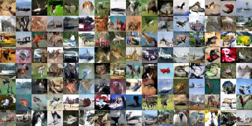
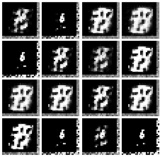
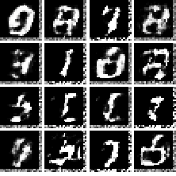
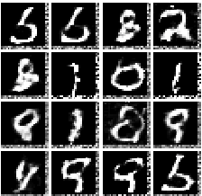
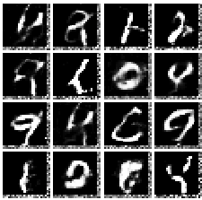

# gans
This repository contains implementation of generative models.
## Prerequisites
- Tensorflow
- Pytorch
- Numpy

##Sample of images trained using Wasserstein GANs

### CIFAR 10

### MNIST
     
  

